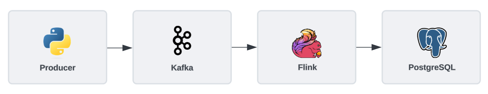

# Music App Event Streaming Pipeline

Designed a streaming data pipeline with simulated event data.

### Overview
- Simulated a datastream using Kafka for user events on a music application
- Utilized Flink to process the data and add geolocation enrichment using an API
- Consumed the data, using Postgres as the sink

### Diagram

### Tools & Technologies
- Docker
- Kafka
- Flink
- REST APIs
- PostgreSQL
