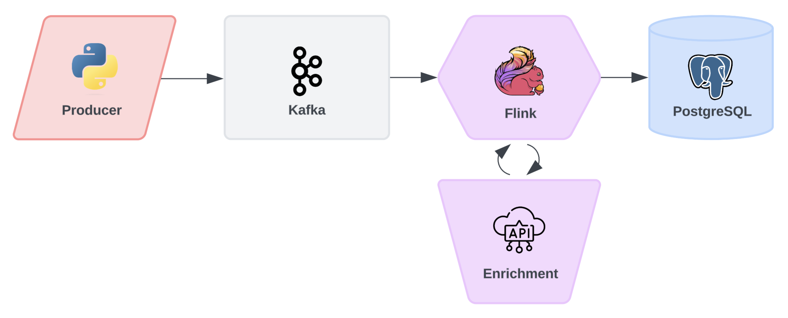

# Kafka ETL Pipeline

Designed a streaming data pipeline with simulated event data.

### Overview
- Simulated data for user events on a music application
- Utilized Kafka to ingest and stream the data
- Consumed the data and stored it in a Postgres table

### Diagram

### Tools & Technologies
- Docker
- Kafka
- PostgreSQL
